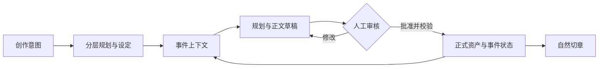

# novel-workbench

面向长篇小说的 AI 创作工作台。系统以 StoryRoom 故事丰富度分层组织全书、卷和事件资产，以确定性 `reading_assets` 控制单事件上下文，再通过动态路由、世界脉冲和多轮展开写出完整事件正文，最后自然切章。

**适用场景**：希望逐步规划、审核和修改长篇设定的创作者，以及研究可控 LLM 工作流的开发者。
技术栈为 Python / FastAPI、React / TypeScript / Vite；支持在界面保存和切换 DeepSeek、
OpenAI 兼容接口、OpenAI Responses、Claude 和 Gemini 配置。

[无密钥演示](docs/DEMO.md) · [贡献指南](CONTRIBUTING.md) · [本地发布检查](docs/RELEASING.md) ·
[安全与数据边界](SECURITY.md) · [真实模型评测方案](docs/EVALUATION.md)

想了解实现取舍，可读 [工程设计阅读索引](docs/ENGINEERING_NOTES.md)。

真实界面与操作路线见 [离线演示截图](docs/DEMO.md#自动验证与记录)。

## 项目状态与能力边界

本项目由个人开发与维护，探索 AI 辅助长篇创作中的流程控制、人工审核和数据一致性。
欢迎分享使用反馈、报告问题，或参与文档与功能改进。

- **可体验**：逐文件审核、分层资产编辑、后台任务进度、版本检查与持久化提交。
- **工程保障**：重复批准幂等、失败回滚、进程崩溃恢复、SSE 回放与本地草稿恢复，均有对应回归测试。
- **尚待验证**：真实模型的长篇文学质量、用户使用效果、实际费用与大规模运行性能。
- **运行范围**：本机单用户工作台；API 尚未提供完整认证和多租户权限控制。

下图展示主要数据流，详细契约仍以 [SPEC](SPEC_v1.md) 为准：



## 当前创作链路

1. `foundation`：`spec00 → world_a → world_b → pow_l → pow_s → pow_e → opp_eco → cast`，每次只生成并审核一个文件，批准后才解锁下一文件。
2. `master_plan`：长线骨架 → 全书 StoryRoom → 全书主要地图。
3. `volume_plan`：卷纲骨架 → 卷 StoryRoom → 卷地图/场景 → 逐事件设计 → `reading_assets`。
4. `event_plan`：`事件约束与展开路线 → 世界脉冲 → 多线事件展开 → 连续场景方案 → 正文前检查与临时资产`，每次只生成、修改并批准一个文件，批准后立即保存断点；若第 5 步检查失败，人工确认后会携带检查意见退回第 4 步，并保留前 3 步。
5. `prose`：五个规划文件全部批准且正文前检查所有维度通过后，严格按批准版本一次写完完整事件正文并执行有界质量选优；事件规划和正文待审核稿采用“AI独立审核当前稿 → 人工微调自动生成的意见 → 在当前稿上定向修订 → 再审核/批准”，不会重跑前序步骤；正文修订后仍须复检通过才能批准。
6. `state_delta`：抽取并审核人物、关系、故事线、实体议程、资产和时间线变化。
7. `chapter_plan`：事件提交后按自然正文锚点切章，不改事件因果。

故事丰富度与结构复杂度分开控制：`low` 复杂度会减少暗线、灰度势力和秘密套层，但不会删掉具体人物反应、关系变化、空间影响、代价与读者回报。

## 文档真值关系

- [`SPEC_v1.md`](SPEC_v1.md)：唯一规范真值源，当前版本 `v1.0+r19`。
- 架构与数据流图见 [`SPEC_v1.md` 的系统概览](SPEC_v1.md#1-系统概览)。
- [`PROMPTS_REVIEW.md`](PROMPTS_REVIEW.md)：由 StepSpec、提示词注册表与模板自动生成的审阅索引。
- `server/src/novelwb/core/step_catalog.yaml`、`step_specs/`、`prompts/registry.yaml`、`schemas/`：可执行契约，必须与 SPEC 同步。
- 早期 Word 提示词包属于历史设计资料，不随当前仓库分发；现行运行提示词以 `server/src/novelwb/prompts/` 为准。

## 快速开始

需要 Python 3.11+、Node.js 和 npm（CI 使用 Node.js 22）。以下命令均在 `novel-workbench`
仓库根目录运行。建议先按 [贡献指南](CONTRIBUTING.md) 创建并激活虚拟环境。
首次安装依赖需要网络，安装完成后的离线演示不调用外部模型。

```powershell
python -m pip install -c server/requirements-dev.lock -e "./server[dev]"
npm --prefix webui ci
npm --prefix webui run build
python scripts/demo.py
```

打开 <http://127.0.0.1:8765/>，选择 `demo-ferry`，在“审核中心”编辑并批准作品规格，
然后在“分层资产”查看正式版本。演示只提供基座第 1/8 个文件的固定响应；
每次运行使用新的 `.checks/demo/` 子目录，具体操作见 [演示指南](docs/DEMO.md)。

### 使用真实模型创作

完成安装与构建后，停止演示服务，从仓库根目录启动普通工作台：

```powershell
python -m uvicorn novelwb.server_main:app --host 127.0.0.1 --port 8000
```

打开 <http://127.0.0.1:8000/>，进入侧栏“模型与 API”：选择服务预设，填写 API 地址、
模型 ID 和密钥，测试连接后保存，再点击“使用此配置”。可以保存多套配置，切换后新任务立即生效。
连接测试会发送短请求，可能产生少量费用。详细兼容范围和密钥保存方式见 [模型配置指南](docs/MODEL_CONFIGURATION.md)。

也可继续使用原来的 `.env` 配置。未启用界面配置，或点击“恢复环境配置”时，使用下面的配置方式。
PowerShell 中执行：

```powershell
if (-not (Test-Path .env)) { Copy-Item .env.example .env }
```

Linux/macOS 中执行 `test -f .env || cp .env.example .env`。
在 `.env` 中填写自己的 `DEEPSEEK_API_KEY`，核对模型配置，并将 `LLM_ADAPTER` 设为 `deepseek`。
然后从仓库根目录启动：

```powershell
python -m uvicorn novelwb.server_main:app --host 127.0.0.1 --port 8000
```

`.env` 和创作工作区不纳入 Git；`.env.example` 只保留空凭据。
模型调用会产生服务方费用；当前离线样例不提供真实费用估算。

修改前端时，可另开终端从 `novel-workbench` 目录启动开发服务器：

```powershell
cd webui
npm ci
npm run dev
```

服务启动后：

- 工作台：`http://127.0.0.1:8000/`
- API 文档：`http://127.0.0.1:8000/docs`
- Vite 开发站点：以终端输出地址为准；`/projects` 与 `/health` 代理到 8000 端口。

生产前端构建使用 `npm run build`，产物写入 FastAPI 包内的 `novelwb/web`，由后端在 `/ui` 挂载。构建产物不纳入 Git，首次克隆后需要执行上述构建步骤。

## 目录结构

```text
novel-workbench/
├── SPEC_v1.md                  # 唯一规范真值源
├── PROMPTS_REVIEW.md           # 自动生成的提示词审阅索引
├── scripts/                    # 规范检查与开发脚本
├── webui/                      # React + TypeScript + Vite 工作台
├── server/
│   ├── src/novelwb/
│   │   ├── core/               # Schema、StepSpec、验证器、常量
│   │   ├── engine/             # 图执行、上下文、质量、状态投影、编排
│   │   ├── prompts/            # 现行提示词模板与注册表
│   │   ├── api/                # FastAPI 路由
│   │   ├── storage/            # 工作区 IO
│   │   └── adapters/           # LLM / Search 适配器
│   ├── tests/                  # 后端测试
│   └── workspace/              # 运行数据，不是源码真值
└── docs/spec_snapshots/        # 冻结枚举基线
```

## 图谱与实现映射

| 流程 | 实现 |
|---|---|
| 图1 作品基座 | `server/src/novelwb/engine/graphs/graph_1.py` |
| 图2 全书 StoryRoom | `server/src/novelwb/engine/graphs/graph_2.py` |
| 图3 卷 StoryRoom、地图与逐事件设计 | `server/src/novelwb/engine/graphs/graph_3.py` |
| 图4 动态事件展开与完整正文 | `server/src/novelwb/engine/graphs/graph_4.py` |
| 图E 事件事实提交 | `server/src/novelwb/engine/graphs/graph_e.py` |
| 图5 自然切章 | `server/src/novelwb/engine/graphs/graph_5.py` |
| 图P 章节许可 | `server/src/novelwb/engine/graphs/graph_p.py` |
| 图S 权威提交 | `server/src/novelwb/engine/graphs/graph_s.py` |
| 人工审核工作流 | `server/src/novelwb/engine/review_service.py` |
| 分层逻辑文件目录与局部合并 | `server/src/novelwb/engine/asset_catalog.py` |
| 上下文切片 | `server/src/novelwb/engine/context_compiler.py` |
| 状态卡投影 | `server/src/novelwb/engine/status_card_projector.py` |

## 校验

```powershell
python scripts/check_spec_sync.py
python scripts/generate_prompts_review.py
cd server
python -m pytest tests/test_pipeline.py -q
python -m pytest tests/test_context_compiler.py -q
```

完成标准：规范同步检查通过；涉及的窄测试先通过；权威、事件和章节提交边界保持隔离；未批准的审核稿不得覆盖现有权威数据。
完整贡献检查见 [CONTRIBUTING.md](CONTRIBUTING.md)，交付脚本检查为 `python -m pytest scripts/tests -q`。

作品基座的八个文件必须逐一生成、逐一审核。当前审核稿可以人工修改；下一文件只读取批准后的权威版本，八个文件全部批准前不会解锁全书总纲。

## 分层资产面板

侧栏“分层资产”会按当前项目动态建立逻辑文件目录。作品基座、全书 StoryRoom、各卷 StoryRoom、
地图、场景和逐事件设计都能单页查看与微调；提交按钮只创建审核稿，批准后才合并回所属权威文件。
每个事件已批准的五个展开规划文件也会形成独立分类与页面；修改上游文件会自动重开其下游规划步骤。
状态卡、最新快照、`ContextPackage` 和事件 `reading_assets` 可在同一目录追踪，但保持只读。


## 可靠性与日常检查

批准同一审核稿会返回已保存结果，避免重复扣账与重复发布。多文件提交使用操作系统锁和持久化撤销日志，失败自动回滚；后端重启后的首次受控读取恢复未完成提交。旧工作区保留历史，并在首次读取时补齐逻辑工件最新版本。

生成任务保存进度与参数；断线会重连当前运行，刷新后可恢复订阅。后端重启后未完成任务显示中断，已批准的文件仍可继续使用。取消在步骤边界生效，当前外部模型请求可能需要等待返回。

审核页和资产编辑页自动保存浏览器本地草稿，切页/刷新后恢复，并提供修改前后对照。来源版本更新会提示冲突；浏览器存储失败时显示复制保存提示。

CLI 与 API 共用工作区配置，可通过 `NOVELWB_WORKSPACE` 指定创作数据目录。项目回归检查全部已提交事件与章节，并显示实际检查数量。可靠性改进与验证记录见 [`docs/OPTIMIZATION_REPORT.md`](docs/OPTIMIZATION_REPORT.md)。

```powershell
python scripts/check_spec_sync.py
python scripts/evaluate_quality.py --output .checks/quality.json
python scripts/smoke_run.py
python scripts/export_spec_jsonschema.py --output .checks/schemas
cd server
python -m ruff check src
python -m ruff format --check src
python -m mypy src
python -m pytest tests -q
cd ../webui
npm run check
npm test
npm run build
cd ..
python -m pip wheel --no-deps --no-build-isolation --no-index --wheel-dir .checks/wheels ./server
python scripts/check_package.py
```

Smoke 与离线评测使用隔离的验证目录，不读写创作运行数据。正文基线检查机械信号和故事约束，文学质量仍由人工审核。CI 运行 Windows/Linux 后端测试和前端检查；依赖更新应先通过上述检查，再更新版本约束。

本地发布准备可执行 `python scripts/check_release.py --history`；暂存后用
`python scripts/check_release.py --index --history` 检查实际提交内容。
详细范围、限制和打包命令见 [RELEASING.md](docs/RELEASING.md)。
早期交付检查的结果与验证范围见 [本地交付验收记录](docs/OPEN_SOURCE_PREP.md)。

## 许可证与贡献

本项目采用 [MIT License](LICENSE)，版权署名为 NewbieonfireSpongeforknowledge。
欢迎学习、使用和贡献，转载或分发时请保留许可证要求的版权与许可声明。
第三方前端依赖的许可文本单独保存在
[THIRD_PARTY_NOTICES.txt](webui/public/THIRD_PARTY_NOTICES.txt)，并随网页和 wheel 分发。

欢迎通过 Issue 交流使用体验与改进建议，也欢迎提交 Pull Request。
开发环境、问题报告和提交约定见 [贡献指南](CONTRIBUTING.md)。
