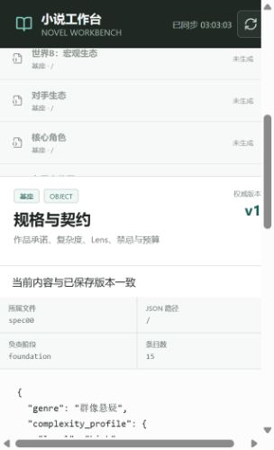

# 无密钥离线演示

这个演示用仓库自带的合成 fixture 演示一次实际审核流程：后台生成作品规格 → 人工编辑 →
批准 → 分层资产查看正式版本。它只覆盖作品基座的第 1/8 个文件 `spec00`，
不包含后续文件的 mock 输出，也不代表真实模型生成小说的质量。

## 启动

按 [README](../README.md) 安装依赖并构建前端后，在仓库根目录执行：

```powershell
python scripts/demo.py
```

浏览器打开 <http://127.0.0.1:8765/>。端口被占用时运行
`python scripts/demo.py --port 8766` 并访问相应地址。

脚本强制使用 mock，忽略本机 `.env` 的模型选择，将本次数据存放在
`.checks/demo/<随机ID>/workspace/`。每次启动创建新目录，保留此前演示记录。
按 `Ctrl+C` 停止服务；普通创作数据不参与演示。

只验证准备过程、不启动 HTTP 服务：

```powershell
python scripts/demo.py --prepare-only
```

## 两到三分钟的演示路线

| 时间 | 操作 | 可以说明的设计 |
|---|---|---|
| 0:00–0:30 | 选择 `demo-ferry`，查看生产流水线和 1/8 文件进度 | 流程按文件推进，后续阶段受审核状态约束 |
| 0:30–1:20 | 打开“审核中心”，查看作品规格，修改 JSON 中 `main_promise` 的文字 | 用户可以修改待审核稿，草稿保存在浏览器本地 |
| 1:20–1:50 | 批准当前文件，查看作品基座进度变化 | 只有批准版本进入正式数据，下一文件才解锁 |
| 1:50–2:20 | 打开“分层资产”，查看作品规格 | 逻辑资产页面追踪已批准版本 |
| 2:20–2:50 | 刷新页面，再查看已批准文件 | 正式数据和运行记录持久化保存 |

批准后请在此结束离线生成演示。第 2 个文件及后续阶段没有 fixture，继续点击生成会触发
结构校验失败；完整创作流程需要按 README 配置真实模型。离线显示的 token 用量来自固定样例，
不能用于估算实际费用。

## 自动验证与记录

下面是在隔离的 `demo-ferry` 项目中实际编辑、刷新恢复并批准后，
浏览器显示 `spec00` 正式版本 v1 的窄视口截图。内容来自 fixture：



```powershell
python scripts/smoke_run.py
python -m pytest scripts/tests -q
```

Smoke 还验证重复运行、重复批准和 SSE 回放。演示目录的 `demo.json` 保存本次项目与运行标识，
便于本地复查；它是生成数据，不能作为源码或真实模型效果证明。

录制演示时只使用本页的 `demo-ferry` 合成项目。截图应注明 fixture 模式，并避免包含
本机绝对路径、个人项目、密钥或未授权文本。
