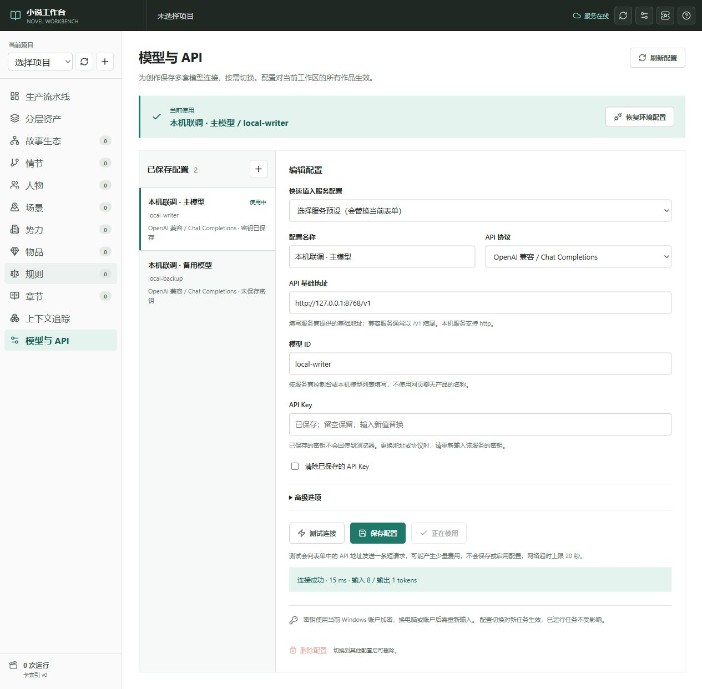

# 配置模型与 API

普通工作台的侧栏和顶栏均有“模型与 API”入口，无需先创建小说项目。
配置对当前工作区全部项目生效；更换 `NOVELWB_WORKSPACE` 会使用另一个工作区的配置。

截图使用本机模拟服务和合成配置，不包含真实密钥；截图中的 API 地址仅用于验收。

## 开始使用

1. 按 [README](../README.md)安装依赖、构建前端并启动普通工作台。
2. 点击“模型与 API”，选择服务预设，填写便于识别的配置名称、API 基础地址、模型 ID 和 API Key。
3. 点击“测试连接”。该操作向表单中的服务发送一次简短生成请求，可能产生少量费用，不发送小说内容。
4. 点击“保存配置”，再点击“使用此配置”。保存和测试都不会自动启用一套新配置。
5. 返回作品继续创作。后续请求使用已启用配置；已经开始或排队的任务继续使用原配置。

没有项目也可以完成设置。模型 ID 请从服务商控制台或本机模型列表确认；预设只填写常见地址和协议，
不验证账号有哪些模型权限。DeepSeek 预设沿用项目原来的模型名称，可按自己的权限修改。

## 接口兼容

| 选择的协议 | 请求路径（相对基础地址） | 适用范围 |
|---|---|---|
| DeepSeek | `/chat/completions` | 保留 DeepSeek 思考模式，可跟随创作步骤 |
| OpenAI 兼容 / Chat Completions | `/chat/completions` | OpenAI 及实现该协议的第三方服务、本机 Ollama/LM Studio 等 |
| OpenAI Responses | `/responses` | 实现 Responses 协议的文本生成接口 |
| Claude Messages | `/messages` | Anthropic 原生 Messages 协议与兼容网关 |
| Gemini generateContent | `/models/{模型ID}:generateContent` | Gemini 的 generateContent 接口 |

常见基础地址已在预设中提供。自定义网关可以保留路径前缀，例如 `https://example.com/proxy/v1`。
只填域名时，普通协议自动补 `/v1`，Gemini 补 `/v1beta`；粘贴完整的 chat/completions、responses
或 messages 地址时会自动去掉末尾端点，避免重复拼接。

本机服务可以使用 HTTP、API Key 留空；远程服务建议 HTTPS。地址不能包含用户名、密码、查询参数或片段。
当前适配的是上述文本生成协议和对应密钥鉴权；需要云厂商签名、特殊查询参数或其他认证机制的接口需另行适配。
连接成功表示当前短请求能完成，不能保证该模型能完成所有长篇结构化步骤。

## 密钥和配置管理

- 多套配置可以使用不同服务、地址、模型与密钥；选中列表中的配置进行编辑。
- 编辑时 API Key 留空保留旧密钥，输入新值替换，勾选“清除”后保存才移除。
- 更换地址或协议不能自动把旧密钥发给新服务，需重新输入新服务密钥，或勾选清除以使用无密钥服务。
- 已保存密钥不会回传浏览器，也不保存在浏览器草稿或 localStorage。新输入只在当前页面内存中暂存，保存后清空输入框。
- 删除使用中的配置前，先启用其他配置或点击“恢复环境配置”。删除会移除该配置和本机保存的密钥。
- 多个页面同时编辑时，过期版本保存会被拒绝，避免静默覆盖；刷新配置后再修改。

配置位于 `workspace/.model-settings/model-profiles.json`，默认忽略并由发布扫描拒绝提交。
Windows 密钥使用当前用户 DPAPI 加密；Linux/macOS 保存为本机明文，目录权限 0700、文件权限 0600。
系统管理员或能控制当前账户的程序仍可能读取密钥。配置文件需像 `.env` 一样保护，不要共享到公开仓库。

## 高级选项和环境配置

- 输出上限取本页上限与具体步骤预算的较小值，需符合模型的输出限制。
- OpenAI 新模型可使用 `max_completion_tokens`，很多兼容服务仍需 `max_tokens`。
- JSON 模式和 temperature 均可关闭，以适配不支持这些参数的模型；步骤的结果解析与校验仍会执行。
- 通用协议不会携带 StepSpec 的 DeepSeek 模型名、thinking 或 reasoning_effort。模型 ID 使用本页选择；
  OpenAI 的推理强度仅在本页明确选择后发送。DeepSeek 可继续使用步骤中的思考策略。
- 长篇生成的默认超时为 600 秒，传输默认不重试。连接测试使用最多 256 输出 tokens、20 秒网络超时，且不重试。
  推理模型若返回空正文，可先核对模型和能力限制，再用实际创作步骤验证；短测试不代表长任务质量。
- “恢复环境配置”保留全部已保存配置，重新使用 `NOVELWB_LLM_ADAPTER` / `LLM_ADAPTER` 和原 DeepSeek 环境设置。
- `NOVELWB_MODEL_SETTINGS_DISABLED=1` 锁定环境配置并禁止界面写入/测试；`scripts/demo.py` 自动启用该标记，
  因此配置真实服务时需退出离线演示，启动普通工作台。

本机浏览器访问 `127.0.0.1` 或 `localhost`；配置页不对局域网或公网客户端开放。
Vite 开发地址支持本机 5173 端口，`/settings` 已代理到后端。当前 HTTP 适配器忽略系统代理且不跟随重定向，
API 返回重定向时应填写最终基础地址。

## 实现与验证

- 契约：`core/model_settings.py`；持久化：`storage/model_settings_store.py`；生成适配：`adapters/llm/configured.py`。
- API：`api/routers/model_settings.py`，配置接口对原始输入及上游错误做脱敏。
- 回归：`python -m pytest server/tests/test_model_settings.py -q`；前端：`npm --prefix webui test`。
- 覆盖配置并发修改、密钥替换/清除、请求错误脱敏、五种协议、实际创作步骤，以及模型切换期间的重复生成保护。
- 规范以 [SPEC 7.1](../SPEC_v1.md#71-本机模型配置) 为准，步骤和提示词的业务契约保持不变。

2026-10-08 本地浏览器验收了主备配置保存与切换、连接成功/失败、刷新和后端重启后的密钥保留、
以及 390px 窄屏布局。全部连接测试使用模拟服务，未使用真实供应商凭据；实际模型权限和生成效果需用户自行测试。

接口依据：[OpenAI Chat Completions](https://developers.openai.com/api/reference/resources/chat/subresources/completions/methods/create)、
[OpenAI Responses](https://developers.openai.com/api/docs/guides/migrate-to-responses)、
[Claude Messages](https://platform.claude.com/docs/en/api/messages/create)、
[Gemini API](https://ai.google.dev/api)。Windows 保护机制见
[Microsoft DPAPI](https://learn.microsoft.com/en-us/windows/win32/api/dpapi/nf-dpapi-cryptprotectdata)。
