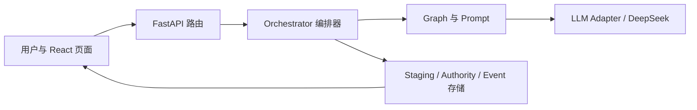

# 00｜项目地图

## 一句话理解

`novel-workbench` 是一个把“小说创作意图”逐层变成可审核资产、事件正文和状态变化的 Web 应用。

它不是让模型直接写完整本书，而是让模型每次完成一个有边界的工作，经过人工审核后再成为后续步骤的依据。

## 六层结构

### 1. 页面层

目录：`webui/src/`

负责：

- 显示项目、步骤、进度和审核单。
- 收集创作意图与人工修改。
- 向后端发送请求。
- 接收生成过程中的 SSE 事件。

核心入口：

- `webui/src/App.tsx`
- `webui/src/api.ts`
- `webui/src/components/PipelineWorkspace.tsx`

### 2. API 层

目录：`server/src/novelwb/api/`

负责：

- 把 HTTP 请求转成 Python 函数调用。
- 校验基础请求参数。
- 把进度和结果返回给页面。
- 把可预期错误变成 HTTP 错误。

核心入口：

- `server/src/novelwb/api/main.py`
- `server/src/novelwb/api/routers/pipeline.py`
- `server/src/novelwb/api/deps.py`

### 3. 编排层

核心文件：`server/src/novelwb/engine/orchestrator.py`

负责：

- 判断当前允许生成哪一步。
- 读取已经批准的上游文件。
- 调用正确的 Graph。
- 保存审核稿。
- 批准时校验并提交权威版本。

把它理解成“生产流水线的总调度员”。

### 4. 生成与规则层

目录：

- `server/src/novelwb/engine/graphs/`
- `server/src/novelwb/prompts/`
- `server/src/novelwb/core/step_specs/`
- `server/src/novelwb/core/schemas/`

负责：

- Graph 决定一次生成需要什么输入、产生什么输出。
- Prompt 决定给模型的具体任务说明。
- StepSpec 声明步骤预算、提示词和输出契约。
- Schema 检查模型结果是否符合结构。

### 5. 模型适配层

目录：`server/src/novelwb/adapters/llm/`

负责：

- 把系统内部调用转换为 DeepSeek HTTP 请求。
- 处理超时、重试、缓存和 Token 记录。
- 隔离外部模型供应商的差异。

当前真实适配器：`deepseek.py`。

### 6. 存储层

目录：`server/src/novelwb/storage/`

运行数据默认位于：`server/workspace/<project_id>/`。

重要概念：

- `staging/`：尚未批准的审核稿。
- `auth/`：已经批准的权威资产。
- `events/`：已经提交的事件事实。
- `snapshots/`：某个时刻的状态快照。
- `runs/`：运行过程和失败信息。
- `publish/`：最终章节。

## 三条最重要的数据边界

### 暂存不等于批准

模型生成成功只会产生审核稿。用户批准后，内容才进入权威层。

### 权威不等于事件

人物设定、世界设定和规划文件属于权威资产；真正发生过的情节进入事件事实。两类数据不能随意混写。

### 事件不等于章节

事件先确定因果与事实，章节只是把已经确认的正文按自然锚点切分发布。

## 第一次自测

不要看答案，先写进 `学习记录.md`：

1. 如果模型生成成功，但用户还没有点击批准，结果应该在哪一层？
2. 如果 DeepSeek 更换成 Gemini，理论上主要替换哪一层？
3. 如果页面一直显示“正在运行”，至少可能涉及哪三个层次？
4. 为什么不能让前端直接调用 DeepSeek？

判断标准：你能够用自己的话回答，不要求使用标准术语。

