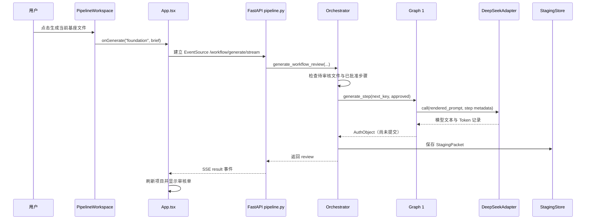

# 01｜第一课：点击“生成”后发生了什么

## 本课目标

学完后，你应该能用 3～5 分钟解释：

> 用户点击“生成作品基座当前文件”后，请求怎样到达 DeepSeek，结果又怎样变成一张等待审核的审核单。

本课暂时不研究批准。生成和批准是两个不同事务，第二课再处理批准。

## 完整链路



## 第 1 站：按钮

必读文件：`webui/src/components/PipelineWorkspace.tsx`

搜索：

```text
生成第
```

你会看到按钮调用：

```ts
props.onGenerate('foundation', { brief: props.brief.trim() })
```

这里没有直接调用模型。组件只把两个信息交给上层：

- 阶段是 `foundation`。
- 用户输入是 `brief`。

### 练习 1

回答：按钮为什么还需要判断 `nextFoundationStep`？如果没有当前可生成步骤，页面应该做什么？

## 第 2 站：建立 SSE 连接

必读文件：`webui/src/App.tsx`

依次搜索：

```text
generateWorkflowReview
startStream
new EventSource
```

`generateWorkflowReview` 把参数整理好，再调用：

```ts
startStream('workflow/generate/stream', params, { workflowReview: true })
```

`startStream` 会：

1. 创建唯一的 `runId`。
2. 用 `EventSource` 连接后端。
3. 监听 `step`、`heartbeat`、`result`、`error` 等事件。
4. 收到 `result` 后关闭连接并刷新项目。

SSE 可以先保持为一句话理解：

> 浏览器建立一条持续连接，服务器可以在模型调用尚未结束时不断发送进度消息。

### 练习 2

在 `App.tsx` 找到以下三种情况分别如何结束连接：

- 正常得到 `result`。
- 用户取消，得到 `cancelled`。
- 发生 `error` 或连接断开。

把每种情况页面会显示的文字写进学习记录。

## 第 3 站：FastAPI 路由

必读文件：`server/src/novelwb/api/routers/pipeline.py`

搜索函数：

```text
generate_workflow_review_stream
```

路由地址是：

```text
GET /projects/{project_id}/pipeline/workflow/generate/stream
```

它做了四件重要的事：

1. 根据 `project_id` 取得编排器。
2. 注册本次运行，以便用户取消。
3. 新建后台线程执行生成，避免 SSE 连接没有任何响应。
4. 把线程产生的进度消息从队列发送给浏览器。

注意：当前代码使用线程和内存队列。这适合本地和单机原型，但服务重启后，正在运行的任务不能自动恢复。这是以后商用化需要解决的问题。

### 练习 3

找到 `worker()` 中的三个结果分支：成功、取消、异常。解释为什么 `finally` 中必须执行 `_finish_run(rid)`。

## 第 4 站：编排器决定“下一步”

必读文件：`server/src/novelwb/engine/orchestrator.py`

搜索函数：

```text
generate_workflow_review
```

当 `stage == "foundation"` 时，编排器会：

1. 获取生成锁，避免两个请求同时生成同一步。
2. 检查是否已有待审核的基座文件。
3. 读取已经批准的基座文件。
4. 从 `FOUNDATION_STEP_ORDER` 找到第一个尚未批准的文件。
5. 根据创作意图识别复杂度。
6. 调用 `Graph1.generate_step(..., commit=False)`。
7. 保存审核稿，而不是直接提交权威文件。

这里最重要的是 `commit=False`。

它说明：

> 生成完成不等于批准，Graph 只能返回候选内容，不能越过人工审核直接改变权威数据。

### 练习 4

用自己的话解释下面三种保护分别解决什么问题：

- `_foundation_generation_lock`
- “已有 pending 审核稿就拒绝继续生成”
- `commit=False`

## 第 5 站：DeepSeek 适配器

必读文件：`server/src/novelwb/adapters/llm/deepseek.py`

先只看：

- `__init__`
- `call`
- `_call_with_retry`

你需要理解：

- API Key 从环境变量读取，只保存在后端。
- 不同 Graph 可以使用不同超时与重试次数。
- 缓存命中时不会再次请求模型。
- `trust_env=False` 表示 DeepSeek 请求不读取系统代理环境变量。
- 调用结果除了文本，还记录输入输出 Token、延迟和缓存状态。

### 练习 5

回答：为什么不能简单地把重试次数从 1 改成 10？至少写出两个代价。

## 第 6 站：审核稿落盘

必读文件：

- `server/src/novelwb/engine/orchestrator.py`
- `server/src/novelwb/storage/staging_store.py`
- `server/src/novelwb/storage/workspace_layout.py`

编排器通过 `_save_auth_review` / `_save_review_packet` 创建 `StagingPacket`，然后由 `StagingStore.save()` 写入：

```text
server/workspace/<project_id>/staging/<staging_id>.json
```

`StagingStore` 使用：

- 文件锁，减少并发覆盖。
- 原子 JSON 写入，避免只写了一半的损坏文件。

此时权威文件还没有变化。

### 练习 6：观察真实数据

在项目正在等待审核时执行：

```powershell
Get-ChildItem server\workspace\测试1\staging
```

选择最新文件后查看：

```powershell
Get-Content server\workspace\测试1\staging\<文件名>
```

不要修改这个运行数据文件。只观察以下字段：

- `staging_id`
- `run_id`
- `review_kind`
- `editable`
- `internal`
- `status`

如果项目名不是“测试1”，把命令中的目录改成真实项目名。

## 本课验证

在 `server` 目录运行相关测试：

```powershell
F:\anaconda\python.exe -m pytest tests\test_pipeline.py -q -k "foundation and review"
```

如果筛选不到测试，不代表功能错误，可以运行：

```powershell
F:\anaconda\python.exe -m pytest tests\test_pipeline.py -q
```

## 本课口头答辩

关闭本文，用自己的话回答：

1. 为什么使用 EventSource，而不是普通的一次性 fetch？
2. 谁决定下一个作品基座文件是什么？
3. Graph 生成成功后为什么还不是权威数据？
4. 审核稿保存在哪里？
5. DeepSeek 超时发生时，错误怎样一路回到页面？

能回答其中 3 个，就可以进入第二课；回答不完整时把问题写入学习记录，不必重读全部代码。

