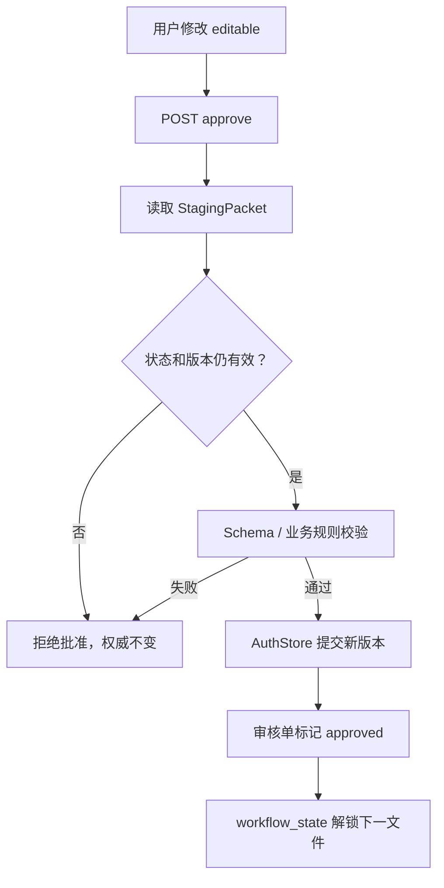

# 02｜第二课：审核、批准与权威文件

## 本课目标

解释这个项目最重要的边界：

> 为什么用户可以修改模型结果，但只有“批准”才能改变后续步骤读取的事实。

## 两份内容

一张审核单同时包含两类信息：

- `editable`：允许用户看见和修改的内容。
- `internal`：系统校验和提交所需的内部依据，例如资产键、基础版本和原始对象。

这不是为了重复保存，而是为了防止用户编辑内容时同时篡改提交目标和版本依据。

## 批准链路



## 必读代码

按顺序阅读：

1. `webui/src/App.tsx` 中的 `approveWorkflowReview`。
2. `server/src/novelwb/api/routers/pipeline.py` 中的 `approve_workflow_review`。
3. `server/src/novelwb/engine/orchestrator.py` 中的同名方法。
4. `server/src/novelwb/storage/auth_store.py` 中的 `commit`。
5. `server/tests/test_pipeline.py` 中关于 foundation review 的测试。

## 为什么修改后仍然安全

批准并不是把文本直接覆盖到任意文件。编排器会根据审核单里的 `review_kind` 和 `internal` 决定：

- 这张审核单属于哪个阶段。
- 它原本针对哪个逻辑文件。
- 生成时依赖的基础版本是多少。
- 修改后的结构是否仍然符合 Schema 和阶段规则。

如果基础版本已经变化，旧审核单应当被拒绝，避免用过期内容覆盖新版本。这叫“防止陈旧写入”。

## 为什么批准后下一步才解锁

作品基座生成时，编排器从 `AuthStore` 读取已经存在的批准资产：

```text
approved = 已经写入权威层的 FOUNDATION_STEP_ORDER 文件
next_key = 第一个不在 approved 中的文件
```

待审核稿只在 `staging/`，不在 `AuthStore`，所以它不会让下一步提前解锁。

## 练习

### 练习 1：状态比较

在批准前后分别观察：

```powershell
Get-ChildItem server\workspace\测试1\staging
Get-ChildItem server\workspace\测试1\auth\artifacts
```

记录哪个目录的文件或版本发生了变化。

### 练习 2：代码追踪

在 `server/tests/test_pipeline.py` 搜索：

```text
approved_count
```

找到证明以下行为的断言：

- 待审核时批准数量仍然为 0。
- 批准后数量变成 1。
- 第二个文件从 locked/不可用变成 available。

### 练习 3：异常思考

回答：

1. 如果用户重复点击批准，系统应该怎样响应？
2. 如果审核单生成后，权威文件已经被另一操作更新，旧审核单还能批准吗？
3. 如果模型返回了看似合理但缺少必需字段的 JSON，应该在哪一层阻止？

## 本课口头答辩

用一句话分别定义：

- 候选内容
- 审核稿
- 权威文件
- 版本
- 回滚

最后回答：

> 这个项目与“一次调用模型后直接保存结果”的工具相比，最重要的工程差异是什么？

